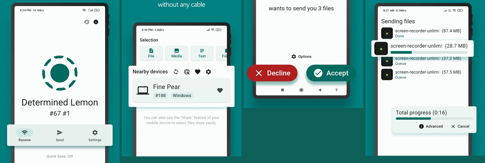
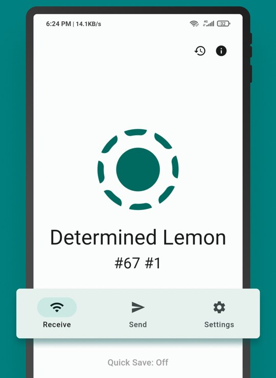
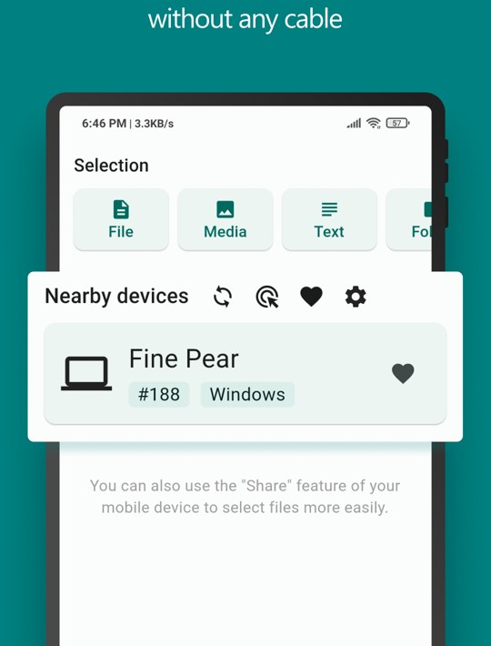
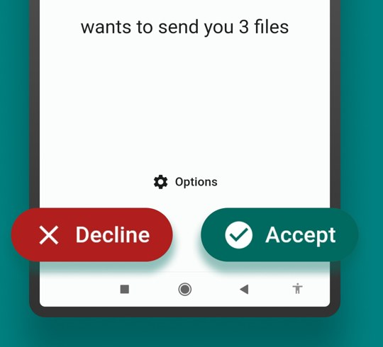
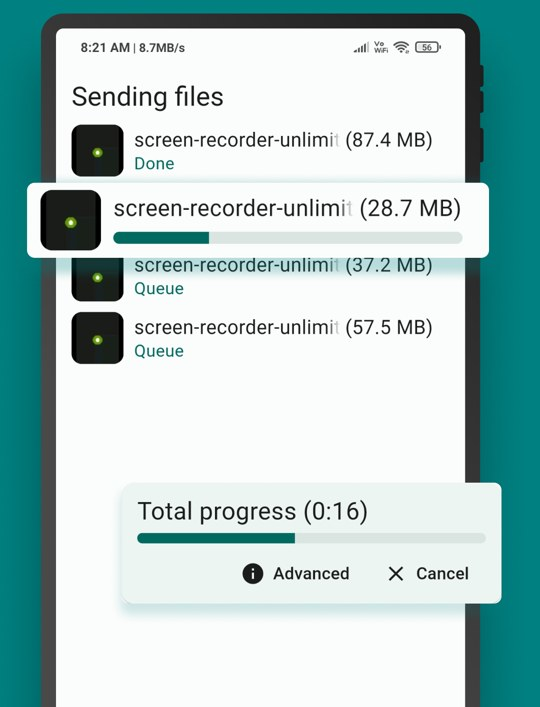
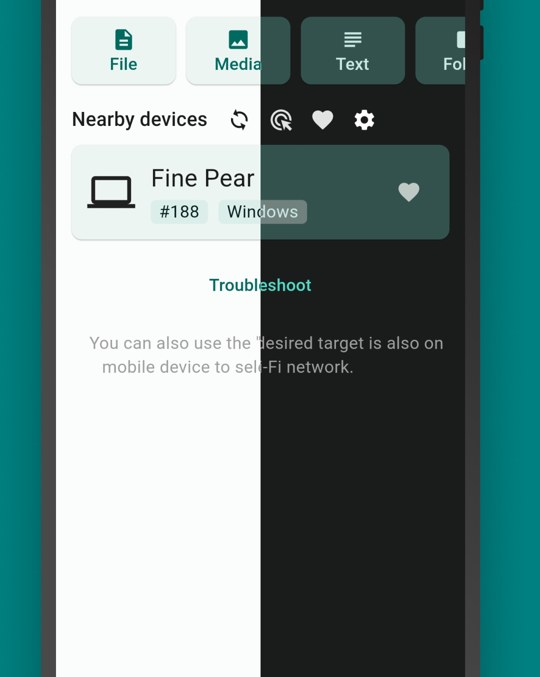
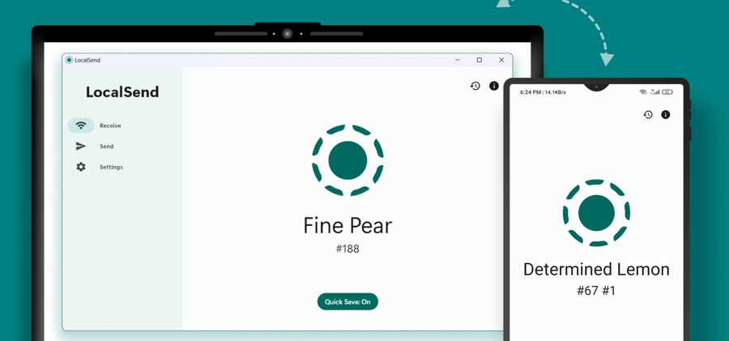
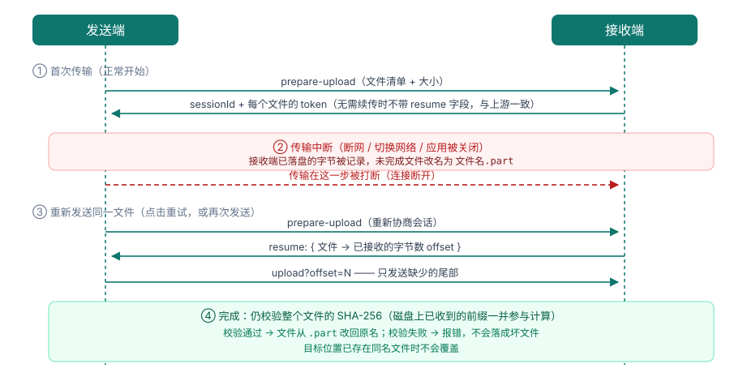

# 局域网给我（juyuwanggeiwo）

> **同一 Wi-Fi 下互传文件与文字 · 手机 ↔ 电脑 ↔ 平板 · 支持断点续传**

不依赖互联网，文件不经由任何服务器中转。基于 [LocalSend](https://github.com/localsend/localsend) 协议实现二次开发，与 LocalSend 客户端**互通**，并额外提供**断点续传**能力。

[](#支持的平台)
[](LICENSE)
[](https://github.com/wangkunmin/juyuwanggeiwo/releases)



---

## 目录

- [这是什么](#这是什么)
- [界面预览](#界面预览)
- [快速上手](#快速上手)
- [断点续传](#断点续传)
- [下载与安装](#下载与安装)
- [常见问题](#常见问题)
- [与官方 LocalSend 的关系](#与官方-localsend-的关系)
- [从源码构建](#从源码构建)
- [许可与致谢](#许可与致谢)

---

## 这是什么

在同一个局域网里，把自己设备上的文件、文件夹或一段文字，直接传给旁边的手机/电脑：

- **不消耗流量**：走局域网，不经过任何中转服务器；
- **不用登录、不用配对**：打开就能看到同一网络下的其他设备；
- **跨平台**：Android / iOS / Windows / macOS / Linux 之间可互相收发；
- **对方没装应用也能收**：浏览器打开链接即可下载（Web 接收模式）。

## 界面预览

下面的截图都取自本应用：

| 接收页 | 发送页（选择内容 + 附近设备） |
|---|---|
|  |  |

| 接收确认（可设 PIN 码） | 传输进度（可查看详情 / 取消） |
|---|---|
|  |  |

| 深色模式 | 手机 ↔ 电脑互传 |
|---|---|
|  |  |

> 想换成自己语言/自己设备的截图？照 [docs/截图指南.md](docs/截图指南.md) 截 6 张放进 `docs/images/` 即可。

## 快速上手

### 1. 发送文件（以手机为例）

1. 两台设备连接**同一个 Wi-Fi**；
2. 打开应用，切到 **发送** 页；
3. 点 **文件 / 媒体 / 文本 / 文件夹** 选择要发的内容；
4. 在「**附近设备**」里点对方设备（截图见上方「发送页」）；
5. 对方确认后即开始传输。

### 2. 接收文件

1. 打开应用停留在 **接收** 页（此时它已在监听，端口 `53317`）；
2. 对方发起后弹出确认框 → 点 **接受**；
3. 文件保存到你设定的目录；开启 **快速保存** 则自动接收，不再逐次确认。

### 3. 对方没有安装应用？

把应用里的 **Web 链接**（在设置里开启）发给对方，对方用浏览器打开即可发送/接收文件。

> 小提示：接收页显示的是设备别名（如 `Determined Lemon`），在设置里可以改。

## 断点续传

传输中断（对端离线、切网、应用被杀）后，**再次发送同一文件不会从 0 开始**：



具体表现：

- **只补缺失部分**：接收端在协商阶段告知自己已经收到多少字节，发送端只发缺少的尾部；
- **半截文件一眼可见**：中断的文件会被改名为 `文件名.part`，续传成功后自动改回原名；
- **绝不覆盖同名文件**：目标位置已有同名文件时不会覆盖；
- **跨重启续传**：未完成进度持久化在应用支持目录（默认 7 天内有效），应用重启后自动对账；文件被删除或长度不符的条目会被丢弃；
- **校验不降级**：续传后仍然校验**整个文件**的 SHA-256（磁盘上已收到的前缀一并参与计算），前缀被改动会被检出并报错，不会产出坏文件；
- **重试即可续传**：失败后点「重试」会重新协商会话并带上偏移（修复了旧实现"重试必失败"的问题）。

**兼容性**：这是本仓库对协议的扩展——`prepare-upload` 响应里可选的 `resume` 字段，以及 `/upload` 可选参数 `offset`。两者缺省时行为与上游完全一致：

| 场景 | 结果 |
|---|---|
| 本应用 → 官方 LocalSend | 正常传输（扩展字段被忽略） |
| 官方 LocalSend → 本应用 | 正常传输（对方不回偏移，接收端从 0 开始） |
| 本应用 ↔ 本应用 | **完整续传能力** |

实现细节与验收证据见 [docs/断点续传方案.md](docs/断点续传方案.md)。

## 下载与安装

### 各平台安装包

发布页（两处同步发布，内容一致）：

- GitHub：<https://github.com/wangkunmin/juyuwanggeiwo/releases>
- Gitee：<https://gitee.com/ynzj/juyuwanggeiwo/releases>

| 平台 | 文件 | 说明 |
|---|---|---|
| **Android** | `juyuwanggeiwo-<版本>-6453-arm64-v8a.apk` | 现代安卓手机（**推荐**） |
| Android | `juyuwanggeiwo-<版本>-6451-armeabi-v7a.apk` | 早期 32 位设备 |
| Android | `juyuwanggeiwo-<版本>-6454-x86_64.apk` | 安卓模拟器 / x86 平板 |
| **macOS** | `juyuwanggeiwo-<版本>-macos-universal.dmg` | 通用二进制（Apple Silicon + Intel），macOS 11+ |
| **Windows** | `juyuwanggeiwo-<版本>-windows-x64.zip` | 解压即用，Windows 10+ |
| **Linux** | `juyuwanggeiwo-<版本>-linux-x86_64.tar.gz` | 解压后运行 `juyuwanggeiwo`（需 GTK3） |
| 校验和 | `SHA256SUMS-*.txt` | 各平台产物的 SHA-256 |

Android 包名为 `com.gitee.ynzj.juyuwanggeiwo`，可与官方 LocalSend **共存安装**。

### 首次打开被系统拦截？

安装包使用自签名证书（没有购买 Apple/Windows 代码签名证书），首次打开可能被拦截，属正常现象：

| 平台 | 处理方式 |
|---|---|
| **Android** | 允许「未知来源」安装即可 |
| **macOS** | 右键（或 Control+点击）App → **打开** → 再点「打开」；或执行 `xattr -dr com.apple.quarantine /Applications/juyuwanggeiwo.app` |
| **Windows** | SmartScreen 提示时点「更多信息」→「仍要运行」 |
| **Linux** | `chmod +x juyuwanggeiwo` 后运行 |

### 支持的平台

| 平台 | 最低版本 |
|---|---|
| Android | 7.0 |
| iOS | 13.0（需自行构建，见下） |
| Windows | 10 |
| macOS | 11 |
| Linux | 依赖 xdg-desktop-portal |
| 浏览器 | Web 链接收发模式 |

## 常见问题

**Q：找不到对方设备？**
确认两台设备在**同一个局域网**（同一个 Wi-Fi 名称，且没有开启"AP 隔离/客户端隔离"）；部分路由器会隔离无线客户端，可在路由器设置里关闭。有线与无线混用时，只要在同一网段通常也能互相发现。

**Q：需要开放端口吗？**
设备之间直连使用 **53317** 端口（HTTPS）。若系统防火墙弹窗，请允许该应用访问局域网。

**Q：会不会经过你们的服务器？**
不会。传输只发生在两台设备之间，应用不向任何服务器上传文件。只有"Web 链接"模式下，接收方通过局域网内的本机 HTTP 服务下载。

**Q：和官方 LocalSend 能互传吗？**
能，双向都可以（见上表）。但**断点续传只在两端都是本应用时生效**。

**Q：macOS 上安装后打不开？**
见上面「首次打开被系统拦截」；另外本应用的 macOS 包是**临时签名**版本，若你之前装过其它签名的同包名版本，需要先卸载再安装。

**Q：文件传到哪儿了？**
接收端设置里可以指定保存目录；Android 也可保存到相册。可在「历史记录」中回看。

## 与官方 LocalSend 的关系

- 本项目是 [LocalSend](https://github.com/localsend/localsend) 的**非官方二次开发**，与 LocalSend 项目方无隶属关系；
- 协议保持兼容：`/api/localsend/v2/*`、组播发现格式、HTTP 头等均未改动，因此可与官方客户端及其他兼容实现互通；
- 新增能力（断点续传）是**可选扩展字段**，对不认识它的对端完全透明；
- 相对上游文件的修改记录见 [NOTICE](NOTICE)，上游原始说明保留在 [README.upstream.md](README.upstream.md)。

## 从源码构建

### 一键打 Android APK（默认只打包、不安装）

```bash
./support/scripts/build_android_apk.sh                 # 三个 ABI 分包（release）
./support/scripts/build_android_apk.sh --debug         # debug 包
./support/scripts/build_android_apk.sh --universal     # 通用包（三 ABI 合一）
./support/scripts/build_android_apk.sh --from-release  # 不打包，直接下载已发布的 APK
./support/scripts/build_android_apk.sh --install       # 可选：打包后用 adb 安装
```

产物在 `app/build/app/outputs/flutter-apk/`，自行安装：

```bash
adb install -r app/build/app/outputs/flutter-apk/app-arm64-v8a-release.apk
# 或把 apk 传到手机后点击安装（需允许「未知来源」）
```

### 容器环境（推荐，锁定工具链版本）

```bash
docker compose -f docker/compose.yaml run --rm rust-test    # Rust：clippy + core/server 测试
docker compose -f docker/compose.yaml run --rm dart-test    # Dart：分析 + 单元测试
docker compose -f docker/compose.yaml run --rm android-apk  # 打包 Android APK
docker compose -f docker/compose.yaml run --rm dev          # 交互开发 shell
```

`docker/README.md` 里有各 target、镜像源配置与平台限制。**iOS / macOS / Windows 需在各自宿主上构建**（macOS 需 Xcode 26+），无法在 Linux 容器内完成。

### 云端构建

`.github/workflows/` 下四个工作流分别产出 Android / macOS / Windows / Linux 安装包，并**同时发布到 GitHub Release 与 Gitee Release**：

- 手动触发：Actions → 选择工作流 → Run workflow；
- 或推送 `v*` 标签，四个平台一起出包。

### 本地工具链

用 `fvm` 管理 Flutter（版本见 [.fvmrc](.fvmrc)），Rust 版本见 [rust-toolchain.toml](rust-toolchain.toml)；核心库测试需带 `--features full`。完整命令、架构说明与注意事项见 [AGENTS.md](AGENTS.md) 与 [docs/README.md](docs/README.md)。

## 许可与致谢

- **许可**：代码采用 [Apache License 2.0](LICENSE)。分发时请保留许可证与归属声明。
- **上游**：[LocalSend](https://github.com/localsend/localsend)（Apache License 2.0，基线提交 `c5bbe3630bb50e0de8253502b41523c4a58825bb`）与协议规范 [localsend/protocol](https://github.com/localsend/protocol)，以及上游作者、贡献者与 Weblate 上的译者。
